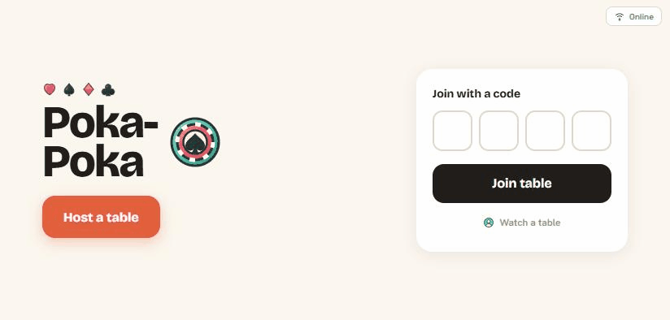

#  Poka-Poka

**Real-time, multiplayer Texas Hold'em for phones.** Friends open the site in a
mobile browser, one player **hosts** a table and sets the rules, everyone else
**joins with a 4‑letter code**, and the whole table stays in sync over a live
WebSocket connection. No accounts, no app install, no real money — just a code
and a browser.

The whole thing ships as **one web service**: a single Node process serves the
static front-end *and* runs the authoritative game over WebSocket on the same port.

---

## Overview

- **Mobile-first, landscape** poker table that several phones share in real time.
- **Host & join flow:** the host configures the rules and gets a room code; players
  join by code, pick a name and a fruit‑hat avatar, ready up, and play.
- **Authoritative server:** all rules, shuffling, turn order and pot math run on the
  server. Clients are dumb renderers — they send *intents* and draw whatever state
  the server broadcasts, so the game can't be cheated from the browser.
- **Per-player state:** each socket only ever receives its own hole cards (others'
  cards are revealed only at a genuine showdown).
- **Built-in resilience:** drop your connection and you keep your seat for 2 minutes
  (shown as "disconnected"); reconnect and you're back with the same chips and cards.

### Features

- No-Limit Texas Hold'em: blinds, side pots, hand ranking, dealer button rotation.
- Redesigned betting bar: **Min / 2× / 3× / All-in** presets, a big slider with
  ± steppers, a live "Raise to" amount, and your own turn countdown.
- **Spectators** ("Watch a table") join instantly as guests — no name or avatar.
- **Character voices:** every fruit avatar speaks its own recorded voice on
  Check / Call / Raise / All-in — heard by the **whole table**, plus a dramatic
  all-in sound. Synthesized SFX for everything else, with a mute toggle.
- **Chat** and **emoji reactions** that pop next to the sender's avatar.
- **Hand-history log:** winner, net profit and pot for every hand — fold-wins
  keep the winner's cards secret (only community cards shown).
- **Card animations** (dealing + community reveal) and a **chips-to-pot** animation.
- **Hand-rankings guide**, winner banner with the **pot amount won**, blind badges,
  and a host option to let **busted players watch everyone's cards**.
- **Increasing blinds** that rise by *progress* (every few hands and on each knock-out),
  not a wall-clock timer.
- **Add to Home Screen / fullscreen** support for a chrome-less, app-like feel.

---

## Preview



*A full loop: Home → Lobby → a hand (deal · your bet · chips to the pot) → showdown → results.*

**No-server preview:** the entire UI can be rendered from sample data without starting
a game — handy for design review. Run the app and open:

| URL | Screen |
|-----|--------|
| `/index.html?mock=lobby` | Lobby (host view) |
| `/index.html?mock=turn` | Table, your turn (betting bar live) |
| `/index.html?mock=handover` | Showdown reveal + winner banner |
| `/index.html?mock=showdown` | Final results / standings |

---

## Tech stack

| Area | Choice | Notes |
|------|--------|-------|
| Runtime | **Node.js ≥ 18** | ESM (`"type": "module"`), no transpiler. |
| HTTP | **Express** | Serves `public/` and the `/assets` icon sprite. |
| Real-time | **Native `ws`** | Hand-rolled rooms, reconnection and ping/pong heartbeats (no Socket.IO). |
| Front-end | **Vanilla HTML / CSS / JS** | **No build step.** Single page; screens toggled by a class. |
| State | **In-memory** | Rooms live in a `Map`; no database. |
| Audio | **Web Audio API + voice pack** | SFX synthesized at runtime; one recorded MP3 per character per action in `public/voice_pack/` (review grid: `/voice-test.html`). |
| Icons | **One SVG sprite** | `assets/icons/poker-icons.svg`, inlined at boot (so gradient fills resolve on iOS Safari). |
| Caching | **Split policy** | HTML/JS/CSS are `no-store` (code updates reach phones on a plain reload); the voice pack + sprite cache for **1 day** via `?v=<ASSET_VERSION>` — bump that constant in `sound.js` after replacing a voice/sprite to push it to all devices immediately. |
| Tests | **`node --test`** | Pure poker engine has unit tests (hand ranking, side pots, lifecycle). |
| Hosting | **Render** (single Web Service) | One service serves HTTP + WS; see `render.yaml`. |

No front-end framework, no bundler, no database — intentionally minimal.

---

## Project structure

```
poka-poka/
├── server/
│   ├── index.js          # Express + HTTP server + ws upgrade (binds process.env.PORT)
│   ├── protocol.js       # Shared message/state contract (C2S, S2C, settings, validation)
│   ├── rooms.js          # Room manager: codes, seating, reconnection, timers, broadcast
│   ├── connection.js     # Per-socket lifecycle: parse/dispatch, heartbeat
│   └── poker/            # Pure engine (no IO): deck, hand-rank, side pots, hand lifecycle (+ tests)
├── public/
│   ├── index.html        # Single page — all screens
│   ├── styles.css        # Design tokens + every screen + the action bar
│   ├── app.js            # State store, render loop, screen routing, action senders
│   ├── net.js            # WebSocket client + sessionStorage reconnect
│   ├── sound.js          # Synth SFX + voice-pack playback (ASSET_VERSION lives here)
│   ├── voice_pack/       # Recorded character voices: <fruit>-<word>.mp3 (36 clips)
│   ├── voice-test.html   # Dev tool: play every character's voice clips
│   └── mock-state.js     # Sample ClientState fixtures for the ?mock= previews
├── assets/icons/         # The icon set (sprite, manifest, palette, preview)
├── package.json
├── render.yaml           # Render deployment config
└── CLAUDE.md             # Architecture & conventions (deep dive)
```

---

## Install

Requires **Node.js 18+**.

```bash
git clone <your-repo-url>
cd poka-poka
npm install        # installs express + ws
```

## Run locally

```bash
npm run dev        # auto-restarts on file changes (node --watch)
# or
npm start          # production mode (node server/index.js)
```

Then open **http://localhost:3000**.

**Play with friends on your LAN (recommended — it's a phone game):**

1. Find your machine's IP (e.g. `192.168.1.42`).
2. On each phone (same Wi-Fi), open `http://<your-ip>:3000`.
3. One phone taps **Host a table**, the others **Join** with the 4‑letter code.
4. Turn phones **sideways** (landscape). Tip: *Share → Add to Home Screen* for fullscreen.

> Open several desktop browser tabs to simulate players too — sessions are per‑tab.

## Test

```bash
npm test           # runs the poker-engine unit tests (node:test)
```

---

## Deployment (Render)

Deploy as a single **Web Service** (config in `render.yaml`):

- **Build command:** `npm install`
- **Start command:** `npm start`
- **Port:** the server reads `process.env.PORT` and binds `0.0.0.0` (Render injects `PORT`).
- **WebSocket:** Render web services support WS on the same HTTP port — no separate service.
- **Health check:** `GET /healthz` returns `200`.

> ⚠️ **In-memory state:** rooms live only in process memory. On Render's free tier the
> service spins down when idle and **cold-starts fresh — active rooms are lost** (any
> deploy/restart also wipes them). That's fine for casual games; reconnection covers
> brief drops. For durability the room `Map` in `rooms.js` is the seam to back with Redis.

---

## How it works (1-minute tour)

```
Phone 1   Phone 2   Phone 3   ...        Each phone holds a WebSocket to the server.
   \         |         /                 Clients send intents (join, ready, fold, raise…)
    \        |        /                  and render whatever authoritative `state` comes back.
     +-------+-------+
             |
   +---------------------+
   |   SERVER (Render)   |  • WebSocket handler  – keeps phones in sync
   |                     |  • Poker engine       – rules, hand ranking, pots
   |                     |  • Room manager       – who's in which game
   |                     |  • Game state (memory)– the single source of truth
   +---------------------+
```

The server tailors every `state` snapshot per recipient so hidden information never
leaks, validates every action, and runs the turn/blind/reconnect timers. See
[`CLAUDE.md`](CLAUDE.md) for the full architecture, the WebSocket protocol, and the
design system.

---

## License

© 2026 **peikopon**. Licensed under **Creative Commons Attribution-NonCommercial 4.0
International (CC BY-NC 4.0)** — see [LICENSE](LICENSE).

You may view, share, and adapt this project **with attribution** and **for
non-commercial purposes only**. Commercial use is not permitted without permission.

> Status: casual hobby project — No-Limit Texas Hold'em v1.1, no accounts, no real money.
> Pot-Limit / Fixed-Limit betting and persistence are possible future additions.
